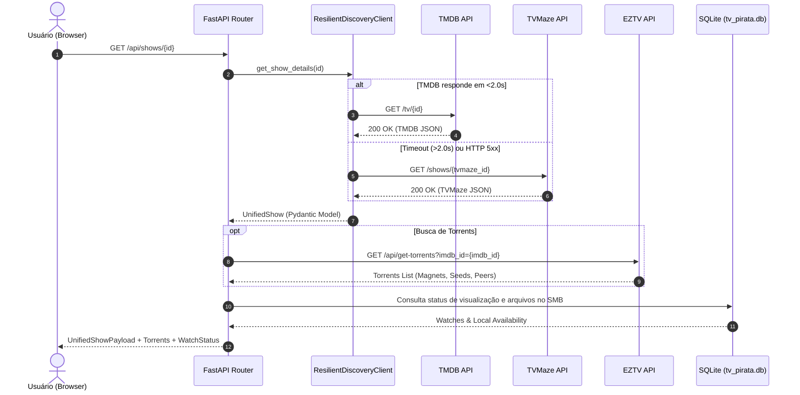
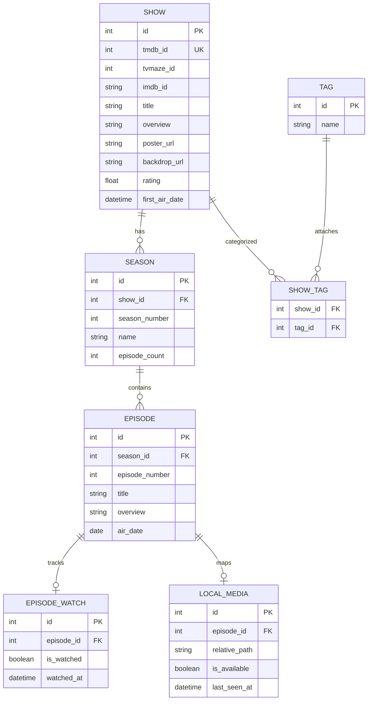

# Blueprint Arquitetural — ADR-002

## 1. Pipeline de Descoberta e Obtenção de Torrents

```mermaid
sequenceDiagram
    autonumber
    actor User as Usuário (Browser)
    participant API as FastAPI Router
    participant Client as ResilientDiscoveryClient
    participant TMDB as TMDB API
    participant TVMaze as TVMaze API
    participant EZTV as EZTV API
    participant DB as SQLite (tv_pirata.db)

    User->>API: GET /api/shows/{id}
    API->>Client: get_show_details(id)
    alt TMDB responde em <2.0s
        Client->>TMDB: GET /tv/{id}
        TMDB-->>Client: 200 OK (TMDB JSON)
    else Timeout (>2.0s) ou HTTP 5xx
        Client->>TVMaze: GET /shows/{tvmaze_id}
        TVMaze-->>Client: 200 OK (TVMaze JSON)
    end
    Client-->>API: UnifiedShow (Pydantic Model)
    opt Busca de Torrents
        API->>EZTV: GET /api/get-torrents?imdb_id={imdb_id}
        EZTV-->>API: Torrents List (Magnets, Seeds, Peers)
    end
    API->>DB: Consulta status de visualização e arquivos no SMB
    DB-->>API: Watches & Local Availability
    API-->>User: UnifiedShowPayload + Torrents + WatchStatus
```

## 2. Diagrama de Entidades e Relacionamentos (ERD)

```mermaid
erDiagram
    SHOW {
        int id PK
        int tmdb_id UK
        int tvmaze_id
        string imdb_id
        string title
        string overview
        string poster_url
        string backdrop_url
        float rating
        datetime first_air_date
    }
    SEASON {
        int id PK
        int show_id FK
        int season_number
        string name
        int episode_count
    }
    EPISODE {
        int id PK
        int season_id FK
        int episode_number
        string title
        string overview
        date air_date
    }
    EPISODE_WATCH {
        int id PK
        int episode_id FK
        boolean is_watched
        datetime watched_at
    }
    LOCAL_MEDIA {
        int id PK
        int episode_id FK
        string relative_path
        boolean is_available
        datetime last_seen_at
    }
    TAG {
        int id PK
        string name
    }
    SHOW_TAG {
        int show_id FK
        int tag_id FK
    }

    SHOW ||--o{ SEASON : has
    SEASON ||--o{ EPISODE : contains
    EPISODE ||--o| EPISODE_WATCH : tracks
    EPISODE ||--o| LOCAL_MEDIA : maps
    SHOW ||--o{ SHOW_TAG : categorized
    TAG ||--o{ SHOW_TAG : attaches
```
